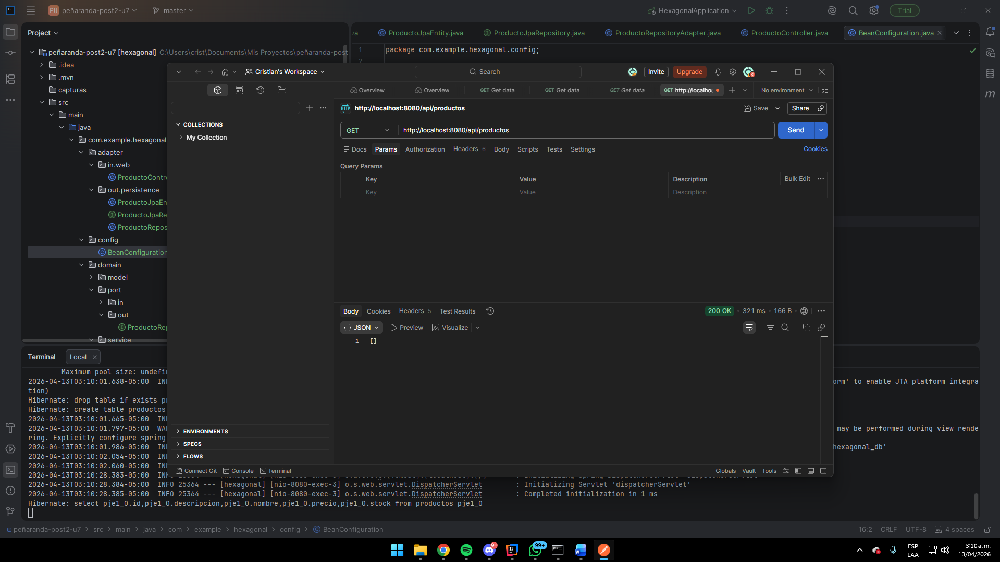
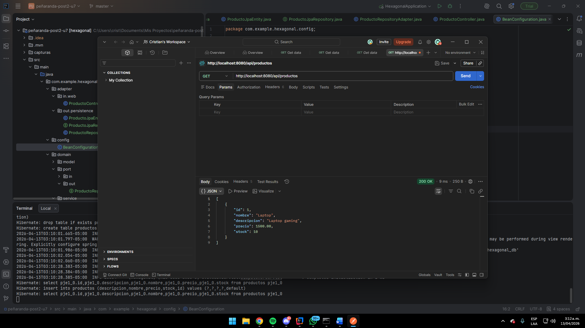
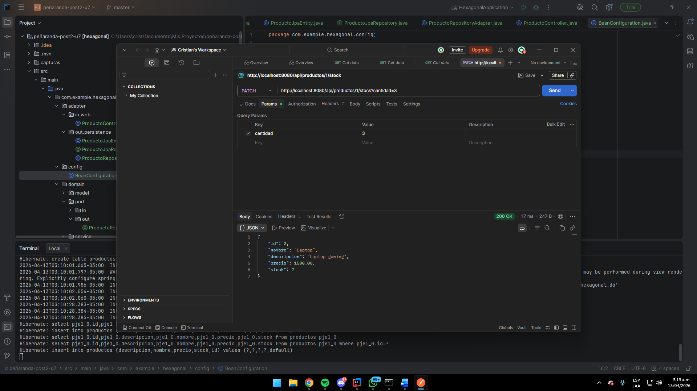
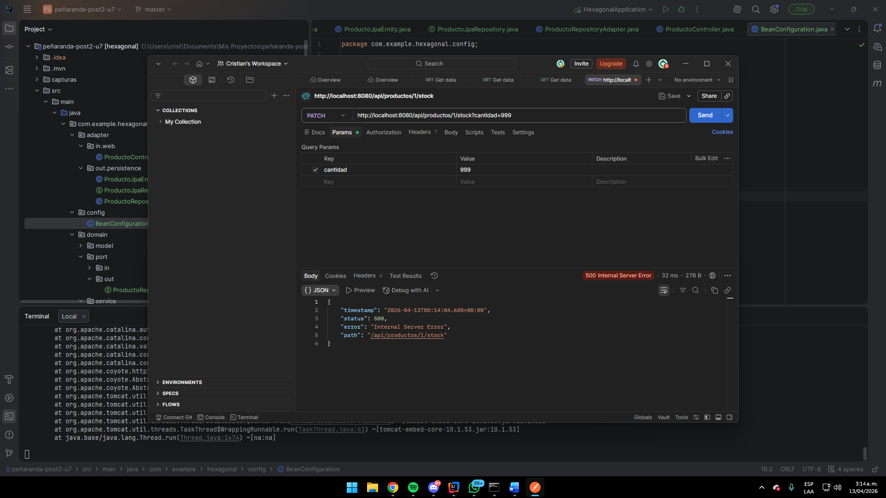
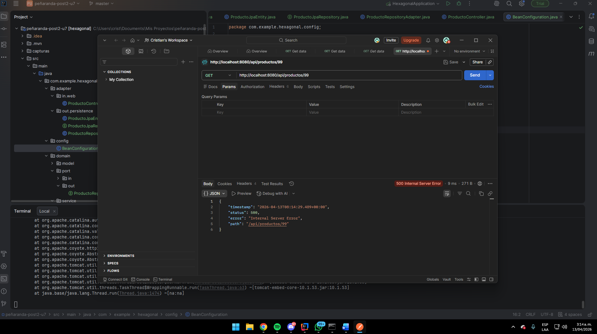

# hexagonal

**Unidad 7 — Post-Contenido 2**  
Curso: Patrones de Diseño de Software  
Universidad de Santander (UDES) — Ingeniería de Sistemas  
Estudiante: Cristian Alonso Peñaranda Parra  
Código: 02230131010

---

## Descripcion

Modulo de gestion de productos implementado con **arquitectura hexagonal (Ports & Adapters)** usando Spring Boot 3.2. El dominio es Java puro sin ninguna anotacion de Spring ni JPA. Los adaptadores REST y JPA se conectan al dominio a traves de interfaces (puertos), manteniendo el nucleo de negocio completamente aislado de detalles tecnicos.

---

## Arquitectura Hexagonal

```
         [Driving Adapter]
         ProductoController
               |
               | llama a
               v
    ┌─────────────────────────┐
    │       DOMINIO PURO      │
    │  ┌─────────────────┐   │
    │  │ port/in/        │   │
    │  │ CrearProducto   │   │
    │  │ ListarProductos │   │
    │  │ ActualizarStock │   │
    │  └────────┬────────┘   │
    │           │             │
    │  ProductoDomainService  │
    │           │             │
    │  ┌────────▼────────┐   │
    │  │ port/out/       │   │
    │  │ RepositoryPort  │   │
    │  └────────┬────────┘   │
    └───────────┼─────────────┘
                | implementado por
                v
    [Driven Adapter]
    ProductoRepositoryAdapter
               |
               v
    ProductoJpaRepository (H2)
```

### Principio clave
El dominio **no conoce** Spring ni JPA. Solo conoce sus propias interfaces (puertos). Los adaptadores son los unicos que conocen los detalles tecnicos.

---

## Estructura de paquetes

```
com.example.hexagonal/
├── domain/                          <- DOMINIO PURO (sin Spring, sin JPA)
│   ├── model/
│   │   ├── Producto.java            <- entidad de dominio (POJO)
│   │   ├── StockInsuficienteException.java
│   │   ├── ProductoNotFoundException.java
│   │   └── PrecioInvalidoException.java
│   ├── port/
│   │   ├── in/                      <- puertos de entrada (casos de uso)
│   │   │   ├── CrearProductoUseCase.java
│   │   │   ├── ListarProductosUseCase.java
│   │   │   └── ActualizarStockUseCase.java
│   │   └── out/                     <- puertos de salida
│   │       └── ProductoRepositoryPort.java
│   └── service/
│       └── ProductoDomainService.java  <- implementa los 3 puertos de entrada
├── adapter/
│   ├── in/
│   │   └── web/
│   │       └── ProductoController.java  <- adaptador REST (driving)
│   └── out/
│       └── persistence/
│           ├── ProductoJpaEntity.java       <- entidad JPA (solo aqui)
│           ├── ProductoJpaRepository.java
│           └── ProductoRepositoryAdapter.java  <- implementa puerto de salida
├── config/
│   └── BeanConfiguration.java       <- wiring de Spring
└── HexagonalApplication.java
```

---

## Tecnologias

| Dependencia | Uso |
|---|---|
| Spring Boot 3.2 | Framework principal |
| Spring Web | Adaptador REST |
| Spring Data JPA | Adaptador de persistencia |
| H2 Database | Base de datos embebida |
| Java 17 | Lenguaje |
| Maven 3.8+ | Gestion de dependencias |

---

## Como ejecutar

### Requisitos
- Java 17 o superior
- Maven 3.8+

### Pasos

```bash
# Clonar el repositorio
git clone https://github.com/CristianPrnda/penaranda-post2-u7.git
cd penaranda-post2-u7

# Ejecutar
mvn spring-boot:run
```

La aplicacion inicia en `http://localhost:8080`.  
Consola H2 en `http://localhost:8080/h2-console` con JDBC URL `jdbc:h2:mem:hexagonal_db`.

---

## Endpoints disponibles

Base URL: `http://localhost:8080/api/productos`

| Metodo | Endpoint | Descripcion | Codigo HTTP |
|---|---|---|---|
| GET | `/api/productos` | Listar todos los productos | 200 OK |
| GET | `/api/productos/{id}` | Buscar producto por ID | 200 OK / 404 |
| POST | `/api/productos` | Crear nuevo producto | 201 Created |
| PATCH | `/api/productos/{id}/stock` | Reducir stock | 200 OK / 400 |

### Ejemplos curl

**Crear un producto:**
```bash
curl -X POST http://localhost:8080/api/productos \
  -H "Content-Type: application/json" \
  -d '{"nombre":"Laptop","descripcion":"Laptop gaming","precio":1500.00,"stock":10}'
```

**Listar todos:**
```bash
curl http://localhost:8080/api/productos
```

**Reducir stock:**
```bash
curl -X PATCH "http://localhost:8080/api/productos/1/stock?cantidad=3"
```

**Stock insuficiente (error de dominio):**
```bash
curl -X PATCH "http://localhost:8080/api/productos/1/stock?cantidad=999"
```

---

## Diferencia clave vs arquitectura en capas

| Aspecto | Arquitectura en Capas | Arquitectura Hexagonal |
|---|---|---|
| Dominio | Puede tener anotaciones JPA | Completamente puro (solo java.*) |
| Dependencias | Capas superiores conocen las inferiores | El dominio no conoce nada externo |
| Testabilidad | Requiere Spring para probar servicios | El dominio se prueba sin Spring |
| Entidad JPA | En la capa de dominio | Solo en el adaptador de persistencia |
| Wiring | Automatico con @Service | Explicito en BeanConfiguration |

---

## Evidencia de funcionamiento

### GET /api/productos — lista vacia


### POST /api/productos — crear producto (201 Created)


### PATCH /api/productos/1/stock — reducir stock


### PATCH con cantidad mayor al stock — error de dominio


### GET /api/productos/99 — producto no encontrado (404)


---

## Checkpoints cumplidos

- El proyecto compila con `mvn clean package` sin errores
- Las clases en `domain/` no tienen ningun import de `org.springframework` ni `jakarta.persistence`
- Los puertos estan en `domain/port/in/` y `domain/port/out/`
- `ProductoDomainService` es una clase Java pura registrada en `BeanConfiguration`
- La entidad JPA `ProductoJpaEntity` existe unicamente en el adaptador de persistencia
- GET /api/productos retorna lista vacia (200 OK)
- POST /api/productos crea un producto y retorna 201 Created
- PATCH con cantidad mayor al stock retorna error con mensaje de dominio
- El repositorio tiene minimo 3 commits descriptivos